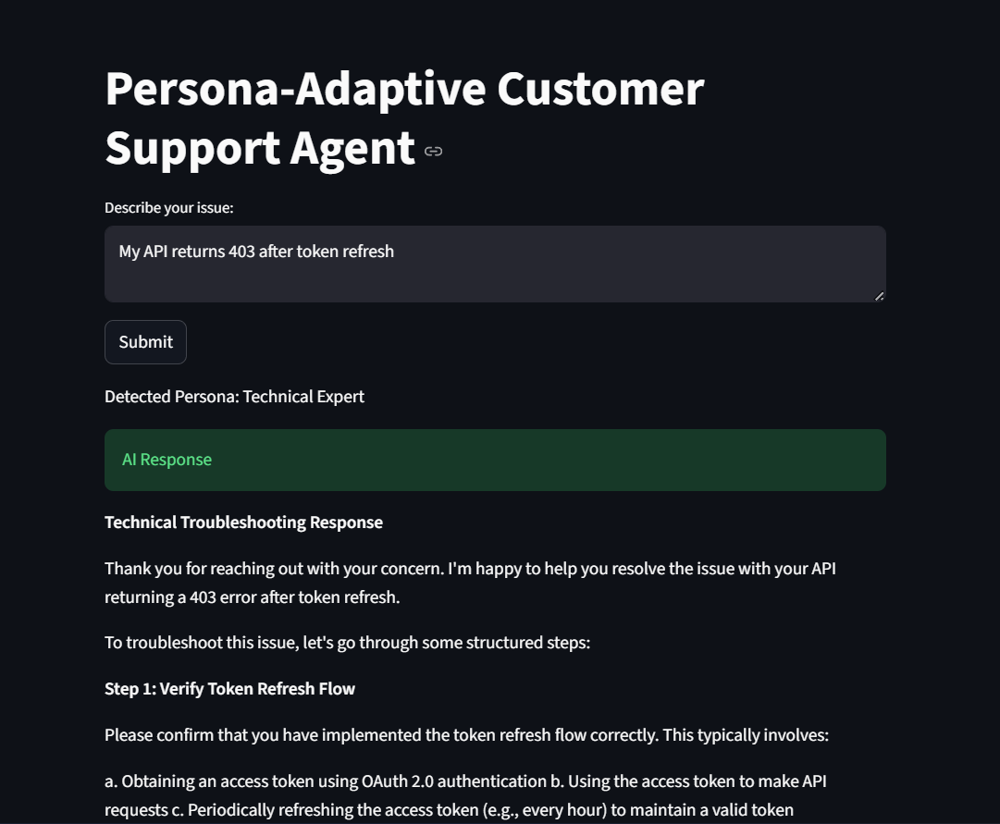
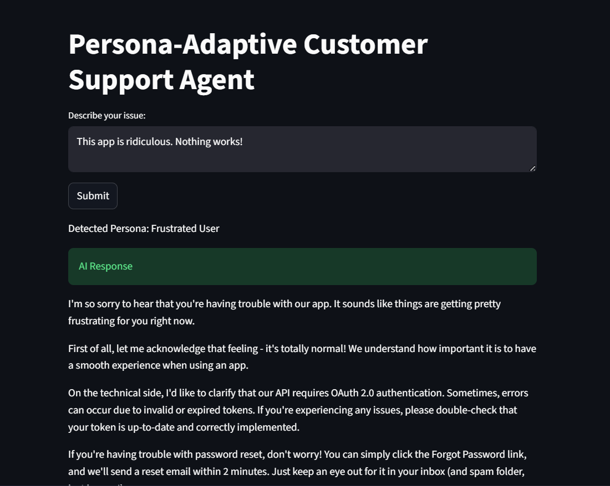
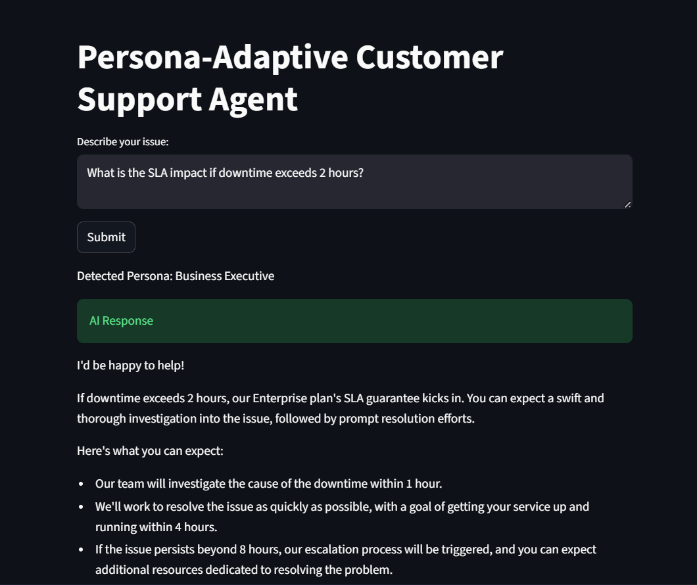

# Persona-Adaptive Customer Support Agent


---

## 📌 Project Overview

This project implements an AI-powered Persona-Adaptive Customer Support Agent capable of:

- Detecting customer persona (Technical Expert, Frustrated User, Business Executive)
- Retrieving relevant knowledge base (KB) content using semantic search
- Adapting response tone dynamically based on the identified persona
- Escalating critical cases to a human agent with proper contextual handoff

The system demonstrates modular AI architecture integrating LLM-based classification, vector search retrieval, adaptive generation, and rule-based escalation.

---

## 🏗 System Architecture

```
User Query
     ↓
FastAPI Backend
     ↓
Persona Detection (LLM-based Classification)
     ↓
Semantic Retrieval (SentenceTransformer + FAISS)
     ↓
Tone-Adaptive Response Generation (LLM)
     ↓
Escalation Logic
     ↓
Final Response OR Human Escalation
```

---

## 🧠 Core Components

### 1️⃣ Persona Detection
- Uses LLM (LLaMA3 via Ollama)
- Classifies users into:
  - Technical Expert
  - Frustrated User
  - Business Executive
- Enables contextual tone adaptation

---

### 2️⃣ Knowledge Base Retrieval
- SentenceTransformer (`all-MiniLM-L6-v2`) for embeddings
- FAISS for efficient vector similarity search
- Retrieves most relevant document context dynamically

---

### 3️⃣ Tone-Adaptive Response Generation
Different system prompts are used based on persona:

- **Technical Expert**
  - Structured
  - Precise
  - Step-by-step

- **Frustrated User**
  - Empathetic
  - Simple language
  - Reassuring tone

- **Business Executive**
  - Concise
  - Impact-focused
  - Timeline-oriented

---

### 4️⃣ Escalation Handling
Rule-based detection for critical queries such as:
- Legal threats
- Severe complaints
- Immediate cancellation demands
- High-risk cases

Returns structured escalation summary including:
- Detected persona
- Original query
- Retrieved context

---

## 🛠 Tech Stack

- Python 3.10+
- FastAPI (Backend API)
- Streamlit (User Interface)
- Ollama + LLaMA3 (LLM Inference)
- Sentence Transformers
- FAISS (Vector Similarity Search)
- NumPy
- Requests
- Pydantic

---

## 📂 Project Structure

```
persona-adaptive-customer-support-agent/
│
├── app/
│   ├── __init__.py
│   ├── main.py
│   ├── persona.py
│   ├── retriever.py
│   ├── generator.py
│   ├── escalation.py
│
├── documents/
│   ├── api_integration.txt
│   ├── billing_policy.txt
│   ├── password_reset.txt
│   ├── refund_process.txt
│
├── screenshots/
│   ├── technical.png
│   ├── frustrated.png
│   ├── executive.png
│
├── ui.py
├── requirements.txt
├── README.md
└── .gitignore
```

---

## 🚀 Installation & Setup

### 1️⃣ Clone Repository

```bash
git clone <your-repository-url>
cd persona-adaptive-customer-support-agent
```

---

### 2️⃣ Create Virtual Environment

**Windows:**
```bash
python -m venv venv
venv\Scripts\activate
```

**Mac/Linux:**
```bash
python3 -m venv venv
source venv/bin/activate
```

---

### 3️⃣ Install Dependencies

```bash
pip install -r requirements.txt
```

---

### 4️⃣ Start Ollama (LLM Backend)

Ensure Ollama is installed and LLaMA3 model is available.

Start server:

```bash
ollama serve
```

If model is not downloaded:

```bash
ollama run llama3
```

---

### 5️⃣ Run Backend API

```bash
uvicorn app.main:app --reload
```

API will run at:
```
http://127.0.0.1:8000
```

---

### 6️⃣ Run Streamlit UI

In a new terminal:

```bash
streamlit run ui.py
```

---

## 🧪 Example Test Queries

### 🔹 Technical Expert
```
My API returns 403 after token refresh.
```

### 🔹 Frustrated User
```
This app is ridiculous. Nothing works!
```

### 🔹 Business Executive
```
What is the SLA impact if downtime exceeds 2 hours?
```

---

## 📸 Sample Outputs

### 🔹 Technical Expert Response



---

### 🔹 Frustrated User Response



---

### 🔹 Business Executive Response



---

## 📊 Design Decisions

- LLM-based persona classification enables flexible NLP understanding.
- FAISS chosen for efficient vector similarity search.
- Modular architecture improves scalability and maintainability.
- Rule-based escalation ensures deterministic critical case handling.
- Separation of backend (FastAPI) and frontend (Streamlit) ensures clean system design.

---

## 🔮 Future Improvements

- Multi-document retrieval (Top-K > 1)
- Persistent vector database
- Logging and monitoring system
- Conversation memory support
- Fine-tuned persona classification model
- Docker containerization for deployment

---

## 📈 Scalability Considerations

- LLM inference can be replaced with hosted APIs (OpenAI / Azure / Anthropic).
- FAISS index can be replaced with scalable vector DB (Pinecone / Weaviate).
- Escalation system can integrate with CRM tools.
- Microservice-based deployment possible.

---

## 👤 Author

**Mayur Patil**  
